                          

<h1 align="center">Toms' Gym</h1>

[View the live project here.](https://tomfinnegan.github.io/milestone-project2/)

This website is one of many marketing tools for tom's gym. It is designed to be responsibe and accessible on a range of devices, making it easy to navigate for potential 
clients                               

  </img>
                                                    
## User Experience (UX)
   I want the webist to be as easliy as possible for people to use the webiste

 ### User stories
 I have a dedicated contact us section which people can get in touch with us as potential clients
 and they can leave comments about ther experience

  #### First Time Visitor Goals
  1. For first time visitors i want people to engage with the gym and see the benefits. 
  
  2. For the first time visitor i want people to see feeback and comments about the gym
     and there experience. 
	
  3. For first time vistiors i want website  to be easy to  navigate . 
    

#### Returning Visitor Goals
    1. As a Returning Visitor i want people to find more information about the gym
    2. As a Returning Visitor i want people to find new information on classes and promotions

 #### Frequent User Goals
    1.  As a Frequent User i want people to spread the word about Tom's Gym
    2.  As a Frequent User i want people to check the website for promotions
        and challenges to get in shape. 

        ### Design
    -   #### Colour Scheme
            There are a wide variety of colors  some are green, light grey, black, light blue, grey
   
       #### Typography

            The main font is "EXO",sans-serif.  
Exo is a geometric sans serif font family. Its design started almost two years ago as way to discover typography in a more advanced way.
Exo is a very complete font family, it has 9 weights both in regular and true italic versions. Each font comes with a lot of opentype features such as small caps, ligatures, alternates, oldstyle figures, tabular figures, fractions, and more.

Reference For the Information about the font family used in this website  is provided by the following  view link here [https://www.1001fonts.com/exo-font.html]

   #### Imagery
   Images are visually important to website's the main image is desgind to be appealing and catch the user's
   attention it's also to give people a feel for the gym

   ### Wireframes

[View the Wireframe here.](https://github.com/tomfinnegan/milestone-project2/blob/master/New%20Project%20(6).pdf)

 

 ## Features

   Responsive on all device sizes
<h2>Technologies Used</h2>

   Languages Used
 HTML5
 CSS3

  
User Experience: (UX)

User Stories:

 First Time Visitor's Goals:
This is the main marketing tool for Tom's Gym . the website is desgined to be responsive and accessible on a wide range of devices from desktop 
to mobile devices this makes the webiste easy to navagate for potential and existing clients.i want the website to help people engage with
 the gym it also provides all of the information about Tom's Gym's  the health benefits all be it mental and physical health it will give
  you the inspriation to get of the couch turn of the telly and hit the gym.

Return Visitor's Goal

as a returning visitor i wanted to see about if people give good feedback from our gym and tell us about there experience with our coaches
 to also tell there frends and family about the gym
also to gain new customers there is a contact form to get in touch with us 

 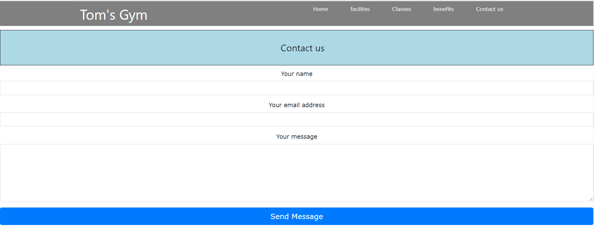</img>

Google Maps
 
 I provided a google maps to find the location of the gym easily  from any where just follow the directions 

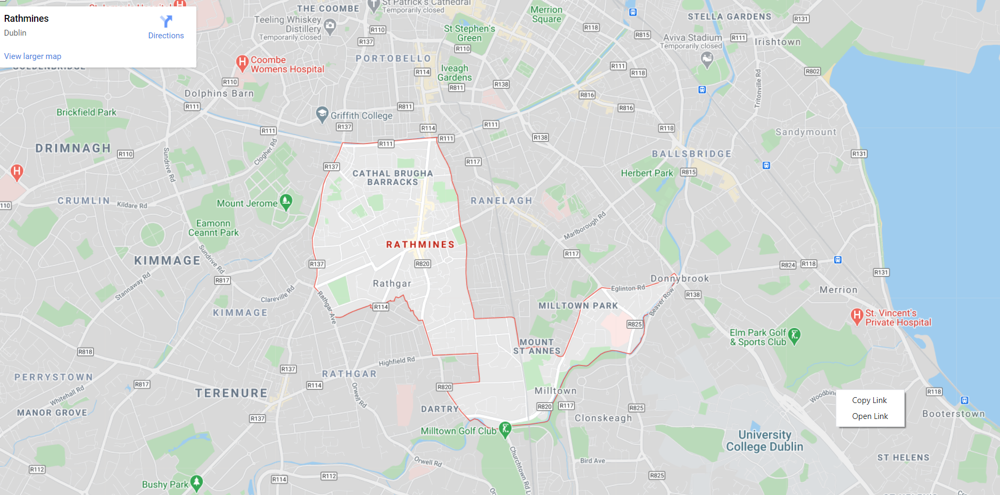</img>

 link ref are:

jquery3.5.1 jquery.min.js 

cdnjs.cloudflare.com

font-awesome 4.7.0.

Frequent User Goals:

As a frequent user i wanted to check  the website for promotions like special prices to different classes it will have special section where people
can sign up to a special program to get fit and ripped just in time for summer with our 6 week special promotion there is also promotions run at different times 
of the year to incentive people to be more active and realize  the benefits of exercise  

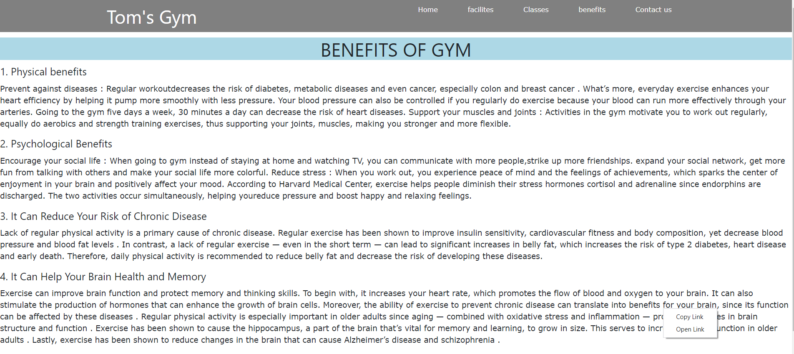</img>

Desgin: 

color scheme:

Typography:

Image: the main image in the website is to engage  with the user and to give visual appeal to the website its also to give perspective clients 
a look around the gym with the facilities provided and also the pictures show all of the equipment available 

Images of the gym

</img>
</img>
</img>
</img>

Wireframes:

features:

Responsive website on devices 
Google maps to help find the location of the gym

Languages used in this  Project

html
CSS3  

Frameworks, Libraries & Programs Used: bootstrap 3.4.1

Bootstrap is used in the implemation of a Responsive website

Google Fonts:
EXO ,sans-serif

Git:
the website was deployed on (e.g. GitHub Pages )

    
Credits:
Content 
The text for section for about us was copied from https://www.rawgyms.com/classes/

 Media: 
 The photos used in this site were obtained from the following website:
 https://www.bing.com/images/search?q=gym+facilities+images&qpvt=gym+facilities+images&form=IQFRML&first=1&tsc=ImageBasicHover&cw=1519&ch=690

validation of the website from w3c validator
 for html

 link to website [https://validator.w3.org/]

Acknowledgements:

Google fonts
bing for the image
raw gyms for paragraph text
ami.responsivedesgin.is/#

 

Testing on w3cvalidator:
all pages passed
errors were shown below in images 

                         ** Index page passed **

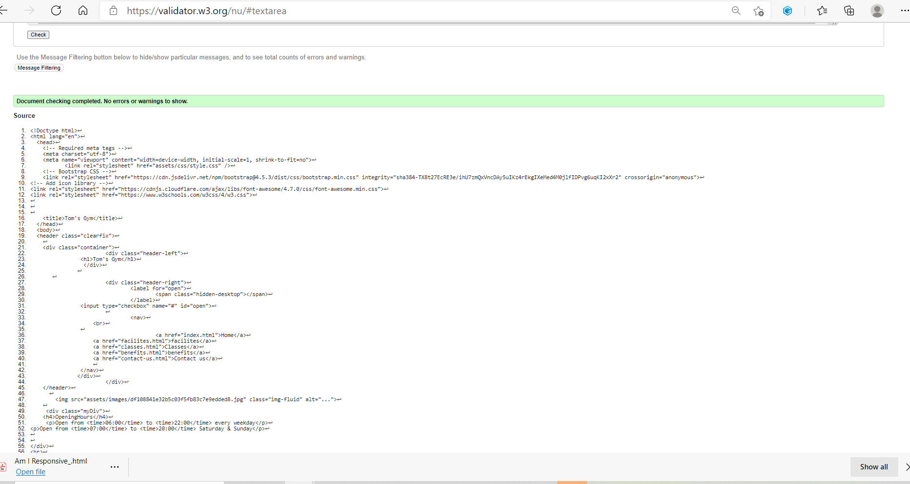</img>

                       **Facilities page with error ** 

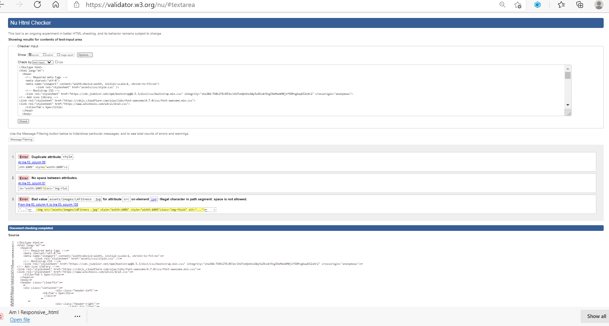</img>

                        **Facilites page with no error **

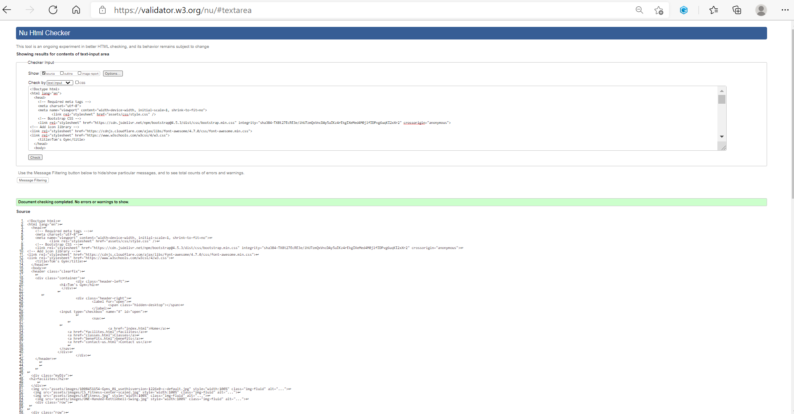</img>

                         ** Classes page no error's **

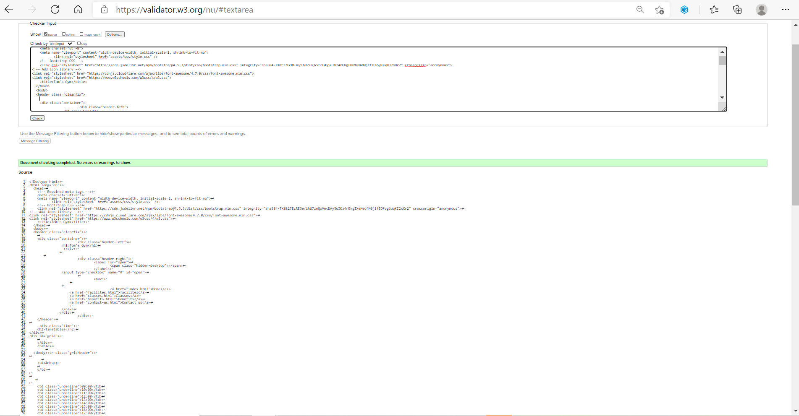</img>

                         ** Benefits page no error **  

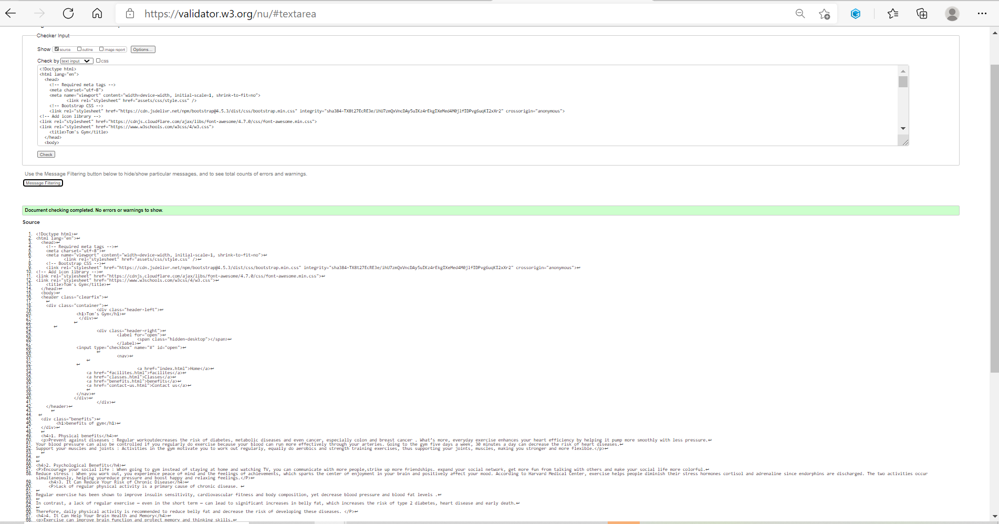</img>

                          ** Contact us  page no error **
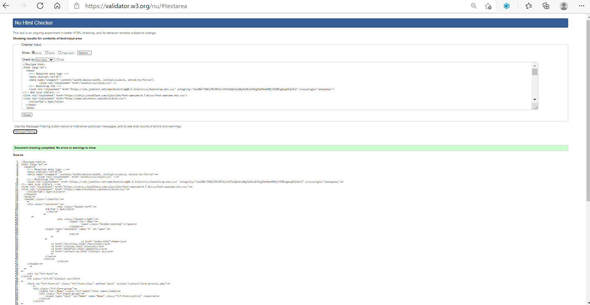</img>
  
                          ** CSS  With Error's **

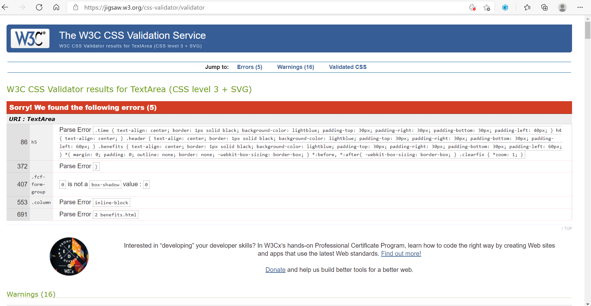</img>

                             ** CSS Without Error's **

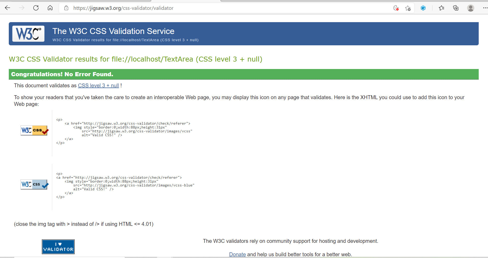</img>

                            ** Git clone images **
</img>

reference below is from the following website [https://www.sitepoint.com/community/t/css-validation-unknown-vendor-extensions/125616]

                        ** V alidation unknown vendor extensions **

There is nothing you can do to validate vendor extensions except to not use them. 
Please explain to your client that there is nothing you can do about this since those errors will help support browser compatibility efforts.
 The validator only validates against valid code. The vendor extensions are proprietary code.
 As such it will always be invalid.