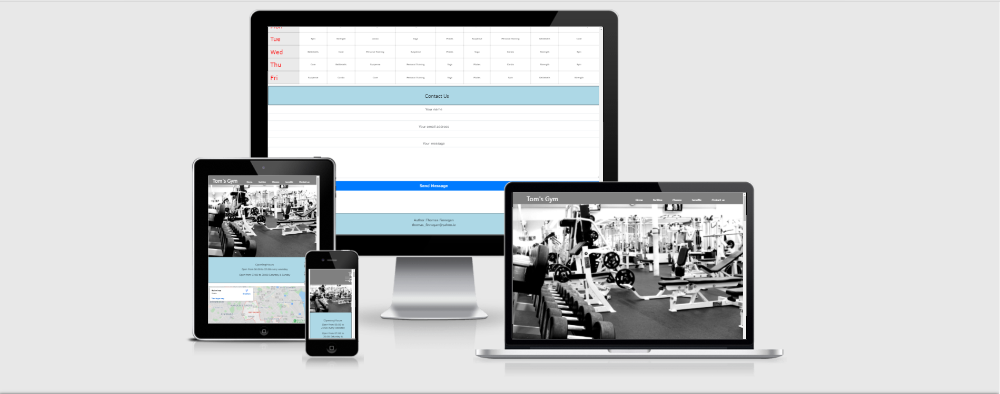
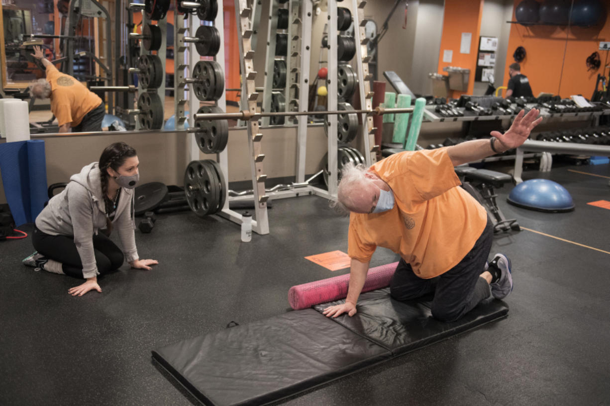
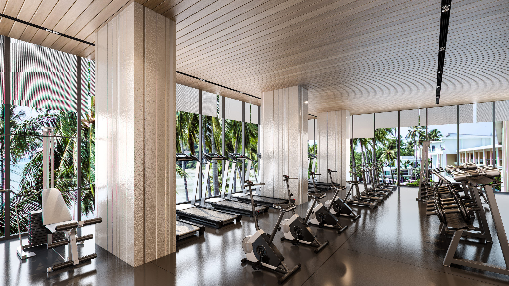

                          

   
 

 <body style="background-color:#1c87c9;">
    <h1 align="center">Toms' Gym</h1>
  </body>

[View the live project here.](https://tomfinnegan.github.io/milestone-project2/)

This website is one of many marketing tools for tom's gym. It is designed to be responsibe and accessible on a range of devices, making it easy to navigate for potential 
clients                               

  </img>
                                                    
## User Experience (UX)
   I want the website to be as easliy as possible for people to use 

 ### User stories
 I have a dedicated contact us section which people can get in touch with us as potential clients
 and they can leave comments about there experience

  #### First Time Visitor Goals
  1. For first time visitors i want people to engage with the gym and see the benefits
     of regular exercise.   
  2. For the first time visitor i want people to see feeback and comments about the gym
     and there experience.	
  3. For first time vistiors i want the website to be easy to navigate. 
    

#### Returning Visitor Goals
    1. As a Returning Visitor i want people to find more information about the gym  prices etc
    2. As a Returning Visitor i want people to find more information on classes and promotions
    3. AS a Returning Visitor i want people to check for new video workouts and  our facilities

 #### Frequent User Goals
    1.  As a Frequent User i want people to spread the word about Tom's Gym
    2.  As a Frequent User i want people to check the website for promotions
        and challenges to get in shape.
    3.  As a Frequent user i want people to tell others about us also to check our dedicated area
        of the benefits of exercise    

        ### Design
    -   #### Colour Scheme
            There are a wide variety of colors  some are green, light grey, black, light blue, grey
   
       #### Typography

            The main font is "EXO",sans-serif.  
Exo is a geometric sans serif font family. Its design started almost two years ago as way to discover typography in a more advanced way.
Exo is a very complete font family, it has 9 weights both in regular and true italic versions. Each font comes with a lot of opentype features such as small caps, ligatures, alternates, oldstyle figures, tabular figures, fractions, and more.

Reference For the Information about the font family used in this website  is provided by the following  view link here [https://www.1001fonts.com/exo-font.html]

   #### Imagery
   Images are visually important to website's the main image is desgind to be appealing and catch the user's
   attention it's also to give people a feel for the gym
                     <h2 align="center">Toms' Gym</h2>
   </img>

   ### Wireframes
Desktop
    [View the Wireframe here.](https://github.com/tomfinnegan/milestone-project2/blob/master/New%20Project%20(11).pdf)

Mobile
  [View the Wireframe here.](https://github.com/tomfinnegan/milestone-project2/blob/master/New%20Project%20(12).pdf)

Tablet
[View the Wireframe here.](https://github.com/tomfinnegan/milestone-project2/blob/master/New%20Project%20(7).pdf)

 

 ## Features

   Responsive on all device sizes

<h2>Technologies Used</h2>

 Languages Used

 
 [HTML5](https://en.wikipedia.org/wiki/HTML5)

 [CSS3](https://en.wikipedia.org/wiki/Cascading_Style_Sheets)
  

### Frameworks, Libraries & Programs Used

[Bootstrap 4.5.3:]
(https://getbootstrap.com/docs/4.4/getting-started/introduction/)

[reference for the text on bootstrap is]  

(https://en.wikipedia.org/wiki/Bootstrap_(front-end_framework))

Bootstrap is a free and open-source CSS framework directed at responsive, mobile-first front-end web development.
It contains CSS- and (optionally) JavaScript-based design templates for typography, forms, buttons, navigation, and other interface components.

[Hover.css:]

(https://www.w3schools.com/howto/tryit.asp?filename=tryhow_css_social_media_buttons2)

Hover.css was used on the Social Media icons in the footer

 [Google Fonts:](https://fonts.google.com/)

Google fonts were used to import the 'EXO, sans-serif'  font into the style.css file which is used on all pages throughout the project.

 [Font Awesome:](https://fontawesome.com/)
    - Font Awesome was used on all pages throughout the website to add icons for aesthetic and UX purposes.

 [GitHub:](https://github.com/)
    - GitHub is used to store the projects code after being pushed from Git.   
   

[Balsamiq:](https://balsamiq.com/)
    - Balsamiq was used to create the [wireframes](https://github.com/) during the design process.

    ## Testing

The W3C Markup Validator and W3C CSS Validator Services were used to validate every page of the project to ensure there were no syntax errors in the project.

-   [W3C Markup Validator](https://jigsaw.w3.org/css-validator/#validate_by_input) 
-   [W3C CSS Validator](https://jigsaw.w3.org/css-validator/#validate_by_input) - 

Testing User Stories from User Experience (UX) Section

### Testing User Stories from User Experience (UX) Section

-   #### First Time Visitor Goals

  1. As a First Time Visitor i want people to understand the websites goal

  2. When people enter the site they can navigate easy with the navigation bootstrap
     which will bring them to the desired page

  3. the main points of the website are the images and text   
 

### Further Testing

The Website was tested on  Internet Explorer
The website was viewed on a variety of devices such as Desktop, Laptop,Tablet

### Known Bugs

Some white space between opening hours and google maps andmembership options
and contact us

    

                    
                    Some images of the webiste below 

 </img>

Google Maps
 
 I provided a google maps to find the location of the gym easily  from any where just follow the directions 

</img>

 

</img>

Images of the gym

</img>
</img>
</img>
</img>

features:

Responsive website on devices 
Google maps to help find the location of the gym

    
Credits:

Content 

The text for section for about us was copied from https://www.rawgyms.com/classes/
 
 Some text for ideas to create the   readme .md  was obtainted from the following website

 https://github.com/Code-Institute-Solutions/SampleREADME

 Media: 
 The photos used in this site were obtained from the following website:
 https://www.bing.com/images/search?q=gym+facilities+images&qpvt=gym+facilities+images&form=IQFRML&first=1&tsc=ImageBasicHover&cw=1519&ch=690

 
Acknowledgements:

Google fonts
bing for the image
raw gyms for paragraph text
ami.responsivedesgin.is/#
Code Institute

 

Testing on w3cvalidator:
all pages passed
errors were shown below in images 

                         ** Index page passed **

</img>

                       **Facilities page with error ** 

</img>

                        **Facilites page with no error **

</img>

                         ** Classes page no error's **

</img>

                         ** Benefits page no error **  

</img>

                          ** Contact us  page no error **
</img>
  
                          ** CSS  With Error's **

</img>

                             ** CSS Without Error's **

</img>

                            ** Git clone images **
</img>

reference below is from the following website [https://www.sitepoint.com/community/t/css-validation-unknown-vendor-extensions/125616]

                        ** Validation unknown vendor extensions **

There is nothing you can do to validate vendor extensions except to not use them. 
Please explain to your client that there is nothing you can do about this since those errors will help support browser compatibility efforts.
 The validator only validates against valid code. The vendor extensions are proprietary code.
 As such it will always be invalid.